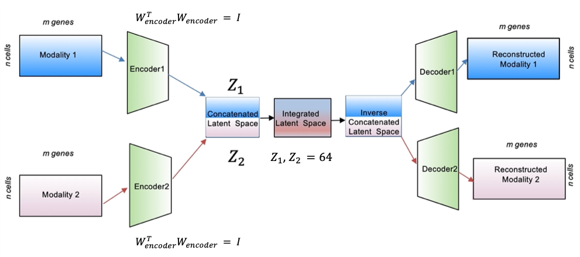

# concatenated Autoencoder for joint embedding of ATAC and scRNAseq

Single cell joint embedding using a concatenated Autoencoder. We obtained the **first place** in the [NeurIPS 2021 single cell competition](https://openproblems.bio/neurips_2021/) Joint Embedding task without pre-training[1].

## Model description

Each modality will first be SVD transformed and concatenated together (denoted as x). The major difference from standard AE is that we incorporated the information from cell annotations (e.g., cell label, cell cycle score, and cell batch) to constrain the structure of latent features. We desire that some latent features (c) predict the cell type information, some features predict the cell cycle score. Noticeably, for feature (b), we want it to predict the batch label as randomly as possible to potentially eliminate the batch effect. z has no constrain at all to ensure the flexibility of neural network.

## Environment

- Python == 3.7.11
- TensorFlow == 2.6.0
- scanpy == 1.8.2
- anndata == 0.8.0

## Citations

[1] [Lance, C., Luecken, M.D., Burkhardt, D.B., et al. (2022). Multimodal single cell data integration challenge: Results and lessons learned. Proceedings of Machine Learning Research, 176:162-176](https://proceedings.mlr.press/v176/lance22a.html)
